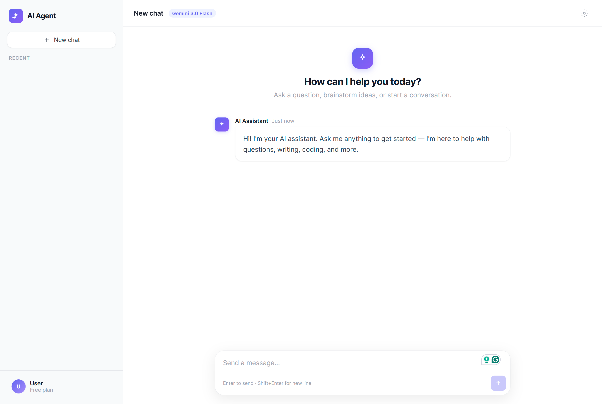

# AI Agent Assistant

A full-stack AI chat agent built from scratch with **Django** and **Google Gemini**. This project walks through setting up a Django app, connecting a frontend chat UI, calling an LLM API, saving conversation history, and personalizing responses with mock user profile data.

Live demo flow: open `/chat/`, send messages, switch conversations in the sidebar, and get context-aware replies powered by Gemini.


## Features

- Chat UI with sidebar, conversation list, and markdown rendering
- REST API backed by Django (`/api/chat/`, `/api/conversations/`)
- Google Gemini integration via `google-genai`
- Conversation history stored in SQLite (`Conversation` + `ChatMessage`)
- Multi-turn context (AI remembers prior messages in the same chat)
- Mock user profile + agent personality from `api/data/mock_users.json`
- Error handling on backend and frontend
- Delete conversations from the sidebar menu

## Preview



## Tech Stack

| Layer | Technology |
|---|---|
| Backend | Django 6, Python 3.13+ |
| Database | SQLite (`db.sqlite3`) |
| AI | Google Gemini (`google-genai`) |
| Frontend | HTML, CSS, vanilla JavaScript |
| Markdown | [marked.js](https://marked.js.org/) (CDN) |


## Project Structure

```
AI_Agent_Development/
├── ai_agent/              # Django project settings & root URLs
│   ├── settings.py        # .env loading, Gemini config
│   └── urls.py            # /chat/ page, /api/ routes
├── api/                   # Main Django app
│   ├── views.py           # Page + API endpoints
│   ├── ai_service.py      # Gemini calls + system prompt
│   ├── models.py          # Conversation, ChatMessage
│   ├── data/
│   │   └── mock_users.json  # Mock user profile & agent personality
│   ├── static/            # chat.js, style.css
│   └── templates/         # chat.html
├── db.sqlite3             # Demo database (included for demo)
├── requirements.txt
├── .env.example           # Environment variable template
└── manage.py
```

## Build Steps (From Scratch)

This repo reflects a step-by-step build:

1. **Django setup** — Create project/app, configure `settings.py`, routes
2. **Chat UI** — Static frontend at `/chat/` (sidebar + message panel)
3. **API wiring** — `POST /api/chat/` connects JS to Django
4. **Gemini integration** — `ai_service.py` calls the model
5. **Error handling** — JSON errors from Django, display in UI
6. **Database** — `Conversation` + `ChatMessage` models, save/load history
7. **Sidebar** — List chats, switch, delete
8. **Conversation context** — Send prior messages to Gemini
9. **Prompt & personality** — Load mock JSON profile into system prompt
10. **Markdown** — Render AI replies with `marked.js`

Full Notes can be found on [here](https://blog-notes.notion.site/ai-agent-dev-notes).

## Installation

### Prerequisites

- Python 3.11+ (tested on 3.13)
- A [Google Gemini API key](https://aistudio.google.com/apikey)

### 1. Clone the repo

```bash
git clone https://github.com/XiyuanWu/AI_Agent_Development.git
cd AI_Agent_Development
```

### 2. Create a virtual environment

```bash
python -m venv venv

# Windows
venv\Scripts\activate

# macOS / Linux
source venv/bin/activate
```

### 3. Install dependencies

```bash
pip install -r requirements.txt
```

### 4. Configure environment variables

```bash
# Windows
copy .env.example .env

# macOS / Linux
cp .env.example .env
```

Edit `.env` and set your API key:

```env
GEMINI_API_KEY=your-gemini-api-key-here
MODEL_NAME=gemini-3-flash-preview
```

### 5. Run migrations (if needed)

The repo includes a demo `db.sqlite3`. If you start fresh or reset the DB:

```bash
python manage.py migrate
```

### 6. Start the server

```bash
python manage.py runserver
```

Open **http://127.0.0.1:8000/chat/**


## Usage

| URL | Description |
|---|---|
| `/chat/` | Chat page (main UI) |
| `/api/chat/` | `GET` messages / `POST` send message |
| `/api/conversations/` | `GET` list all conversations |
| `/api/conversations/<id>/` | `DELETE` a conversation |
| `/admin/` | Django admin (optional) |

### Example API request

```bash
curl -X POST http://127.0.0.1:8000/api/chat/ \
  -H "Content-Type: application/json" \
  -d '{"message": "Hello!"}'
```

### Try the mock profile

The AI knows the fictional user **Alex Chen** from `mock_users.json`. Try asking:

- `What's my name?`
- `How much is in my savings account?`
- `What's my monthly budget?`


## Environment Variables

| Variable | Required | Description |
|---|---|---|
| `GEMINI_API_KEY` | Yes | Google Gemini API key |
| `MODEL_NAME` | No | Model id (default: `gemini-3-flash-preview`) |
| `DJANGO_SECRET_KEY` | No | Django secret (dev fallback in settings) |
| `DJANGO_DEBUG` | No | `True` / `False` (default: `True`) |


## Demo Data

### `db.sqlite3` (included)

A sample SQLite database is **committed on purpose** so others can run the project and see example conversations immediately.

Current sample data only contains harmless demo chats (e.g. math questions, mock finance questions). **No real user credentials are stored.**

### `api/data/mock_users.json`

Fictional user profile and agent personality used for personalized replies. All data is made up for demonstration.


## Privacy & Security

Before publishing or sharing this repo, verify:

| Item | Status | Notes |
|---|---|---|
| `.env` | Gitignored | **Never commit** — contains your real `GEMINI_API_KEY` |
| `.env.example` | Safe | Placeholder values only |
| `db.sqlite3` | Tracked (demo) | Only include demo chats; delete or reset before push if you tested with personal messages |
| `mock_users.json` | Safe | Fictional profile data |
| `settings.py` | Dev defaults | Uses `django-insecure-...` fallback key — **not for production** |

### Recommendations

- Keep `.env` local only
- If you chat with real/private content locally, run `python manage.py flush` or delete `db.sqlite3` and re-migrate before pushing
- For production: set `DJANGO_DEBUG=False`, use a real `DJANGO_SECRET_KEY`, and do not ship the demo database

